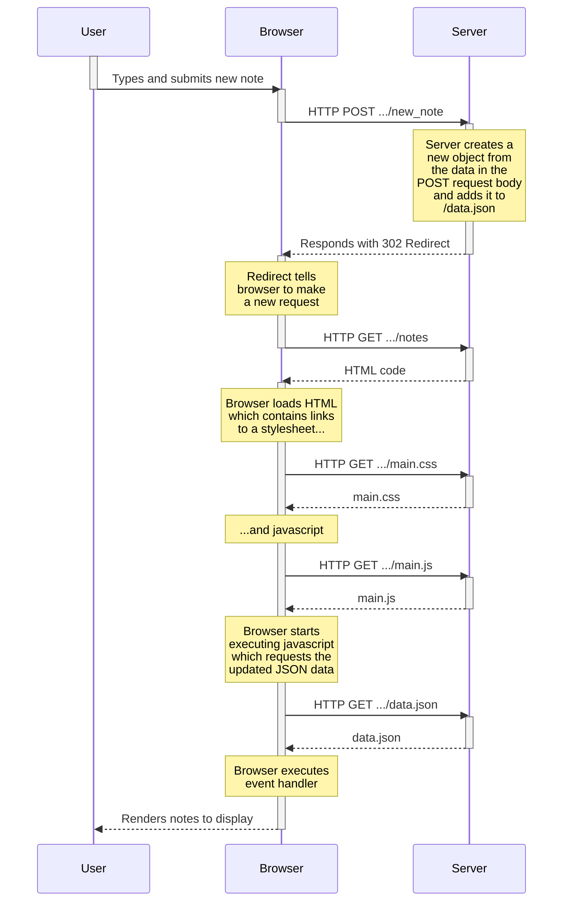

## 0.4: new note
The user creates a new note on page https://fullstack-exampleapp.herokuapp.com/notes by writing something into the text field and clicking the submit button.

```mermaid
sequenceDiagram
    participant u as User
    participant b as Browser
    participant s as Server
    activate u
    u ->> b: Types and submits new note
    deactivate u
    activate b
    b->>s: HTTP POST .../new_note
    deactivate b
    activate s
    Note over s: Server creates a <br/> new object from <br/> the data in the<br/>POST request body <br/> and adds it to <br/> /data.json
    s-->>b: Responds with 302 Redirect
    deactivate s
    activate b
    Note over b: Redirect tells <br/> browser to make <br/> a new request
    b->>s: HTTP GET .../notes
    deactivate b
    activate s
    s-->>b: HTML code
    deactivate s
    activate b
    Note over b: Browser loads HTML <br/> which contains links <br/> to a stylesheet...
    b->>s: HTTP GET .../main.css
    activate s
    s-->>b: main.css
    deactivate s
    Note over b: ...and javascript
    b->>s:HTTP GET .../main.js
    activate s
    s-->>b: main.js
    deactivate s
    Note over b: Browser starts <br/> executing javascript <br/> which requests the <br/> updated JSON data
    b->>s:HTTP GET .../data.json
    activate s
    s-->>b: data.json
    deactivate s
    Note over b: Browser executes <br/> event handler
    b-->>u: Renders notes to display
    deactivate b

```