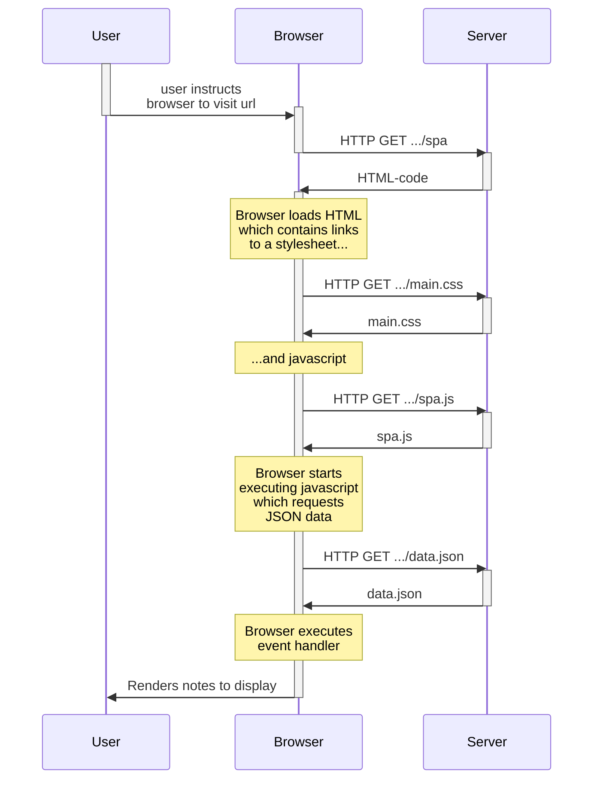

## 0.5: Single page app
The user goes to the single page app version of the notes app at https://fullstack-exampleapp.herokuapp.com/spa.

```mermaid
sequenceDiagram
    participant u as User
    participant b as Browser
    participant s as Server
    activate u
    u->>+b: user instructs <br/> browser to visit url
    deactivate u
    b->>-s: HTTP GET .../spa
    activate s
    s->>-b: HTML-code
    activate b
    Note over b: Browser loads HTML <br/> which contains links <br/> to a stylesheet...
    b->>s: HTTP GET .../main.css
    activate s
    s->>b: main.css
    deactivate s
    Note over b: ...and javascript
    b->>s:HTTP GET .../spa.js
    activate s
    s->>b: spa.js
    deactivate s
    Note over b: Browser starts <br/> executing javascript <br/> which requests <br/> JSON data
    b->>s:HTTP GET .../data.json
    activate s
    s->>b: data.json
    deactivate s
    Note over b: Browser executes <br/> event handler
    b->>-u: Renders notes to display
    
```