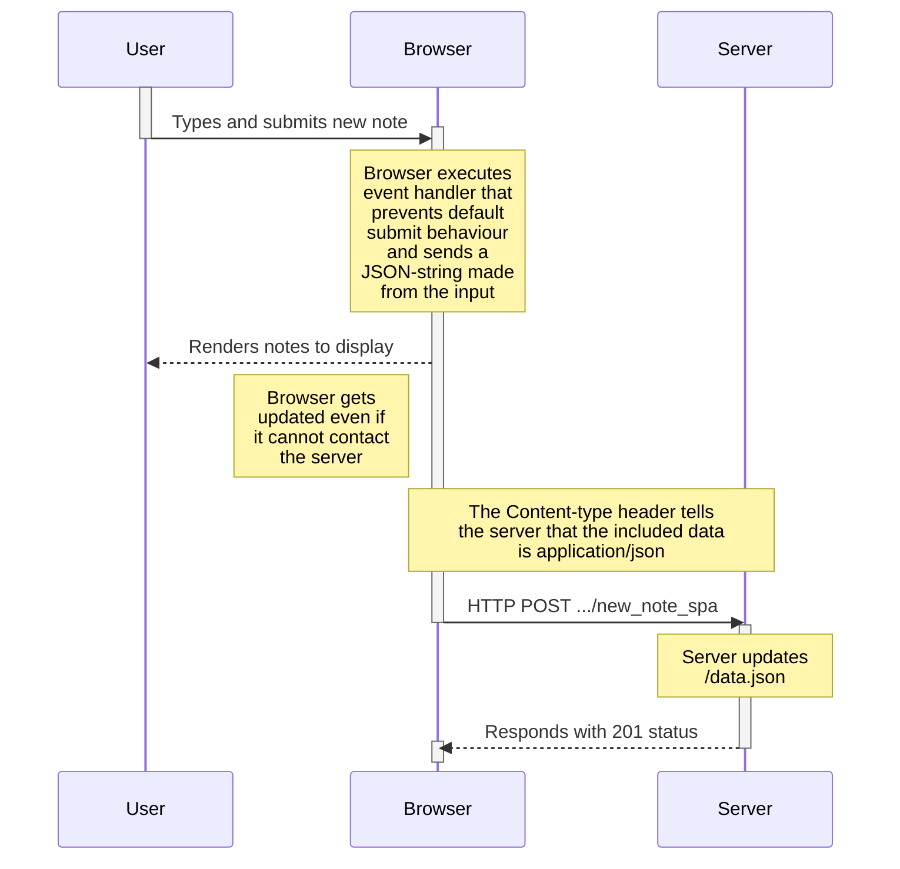

## 0.6: New note (SPA)
The user creates a new note using the single page version of the app.

```mermaid
sequenceDiagram
    participant u as User
    participant b as Browser
    participant s as Server
    activate u
    u ->>+ b: Types and submits new note
    deactivate u
    Note over b: Browser executes <br/> event handler that <br/> prevents default <br/> submit behaviour <br/> and sends a <br/> JSON-string made <br/>from the input 
    b-->>u: Renders notes to display
    Note left of b: Browser gets <br/>updated even if <br/> it cannot contact <br/>the server
    activate u
    Note over b,s: The Content-type header tells <br/> the server that the included data <br/> is application/json
    b->>-s: HTTP POST .../new_note_spa
    activate s
    Note over s: Server updates <br/> /data.json
    s-->>-b: Responds with 201 status
    activate b
    deactivate b
    

```